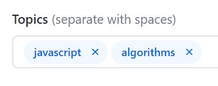

# MEEP Scanner

The *MEEP Scanner* is a lightweight action that integrates with the [More Eyes, Plz!](https://moreeyesplz.com) service. When installed in a repository, the scanner scans commit messages for the `[MEEP]` or `[meep]` string. When present, the commit becomes indexed in the MEEP database for others in the community to discover.

Note that this action only works on repositories that are *public* at this time. Without public visibility, outside members of the community will not be able to view your commits to provide feedback.

## Usage

For each repository you wish to potentially request feedback on, please performing the following steps:

### 1. Add topics to your repository

Topics added help others discover your requests more easily through filters. To do this, hit the settings wheel at the top right of your repository's home page. Then, add topics that pertain to your code. This could be the programming language, a framework or library you're using, or any other general tag.



### 2. Install the *MEEP Scanner* action

In your repository, make the file `.github/workflows/meep.yml` with the following contents:

```yml
name: meep_scanner
on: [push]

jobs:
  meep_scan:
    runs-on: ubuntu-latest
    steps:
    - uses: moreeyesplz/meep_scanner@master
      with:
        github-token: ${{ secrets.GITHUB_TOKEN }}
```

This will cause the scanner to run each time you push to the repository.

### 3. Tag commits you'd like feedback on with `[MEEP]`

When you write a commit you'd like another set of eyes on, include the text `[MEEP]` somewhere in your commit message. For best results, it's recommended that you:

- DO include some context about what you'd like insight on
- DON'T request feedback on overly trivial changes

### 4. Follow the discussion!

Your commit will be listed along with the repository tags on the *More Eyes, Plz!* [website](https://moreeyesplz.com).
Feedback will be provided in the form of comments on your commit within Github. You'll receive notifications when people make comments or ask for clarification.

### 5. Thank your reviewers!

Don't forget to thank your reviewers with a kind note or a healthy number of emoji.